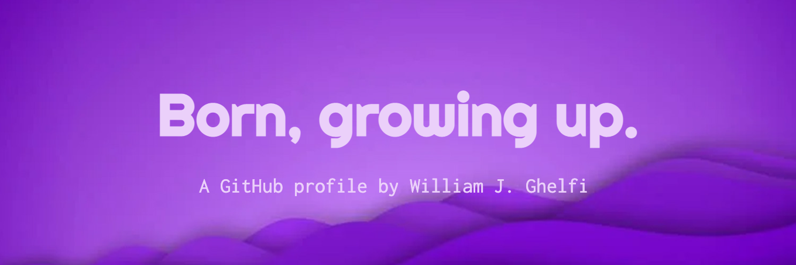

# 

👋🏻 Hey, please call me Will.

🐣 Born in 1977 in Italy, I never stopped growing since.

☎️ I started programming in 1986.  
💻 Professionally in 2000.  
💅🏻 As a frontend developer in 2004.
⛑ I'm also interested in [DevX](https://devxconf.org/).

🔮 I see myself coding till I die, all the while sharing my knowledge, helping newcomers grow, leading technical advancements and transformations, contributing to Open Source.

👨🏻‍💻 My dream job is at a product company, fully remote or remote first, within a smallish, supportive team, working with a fairly modern tech stack, where I can keep on learning and honing my skills.

🍊 I am a [Gitpod](https://github.com/gitpod-io) Community Hero 🦸🏻.

## What I love (in tech)

## Highlights

🤖 [Nx plugin for OpenAPI](https://github.com/trumbitta/nx-trumbitta/tree/main/packages/nx-plugin-openapi)  
✍🏻 [Nx for newcomers](https://trumbitta.hashnode.dev/series/nx)  

## And now, more bullet points because I'm lazy

🌱 I’m currently learning more and more each day about [Nx](https://github.com/nrwl/nx)  
📫 Reach me at: https://twitter.com/trumbitta  
💬 Ask me about anything really  
⚡ Fun fact: I am a published poet
